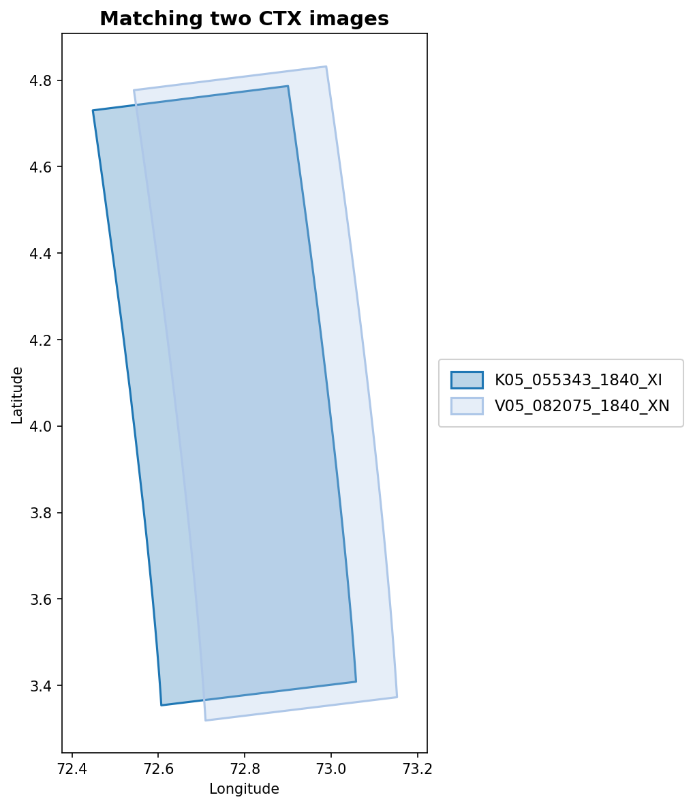

When you need to align two overlapping satellite images of Mars to sub-pixel
accuracy, the USGS ISIS photogrammetry suite is the standard toolkit.
It has been used to process imagery from nearly every planetary mission for
decades. But the minimal case --- two images, no ground control --- turns out to
have its own peculiar set of challenges that I hadn't fully appreciated until I
spent a day working through them empirically.

This post collects the surprising things I learned while matching a pair of MRO
Context Camera (CTX) images using the ISIS `autoseed` / `pointreg` / `jigsaw`
pipeline.

## The setup

Two CTX images (K05_055343 and V05_082075) overlap in a region of Mars where no
HRSC ortho-image is available --- an "HRSC gap." Our project's primary objective
is to coregister CTX against new HRSC Level 5 ortho-images, which provide ~12.5
m/pixel absolute reference --- far better than the traditional MOLA baseline at
~463 m/pixel. In the gaps, we could fall back to MOLA, but we'd prefer to chain
CTX images across the gap, anchored at both ends by images that were already
matched against HRSC using our main coregistration pipeline. This means the gap
interior inherits the HRSC geometric accuracy without ever touching MOLA.

To build that chain, we coregister overlapping CTX images against each other
using tie points in detector (Level 1) space, then bundle-adjust to correct the
camera pointing. The images are 6 m/pixel push-broom strips, roughly 30 km wide
and 100 km long, overlapping by about 30 km in the cross-track direction.

{#fig-footprints}

## Surprise 1: Default parameters are terrible

ISIS ships with conservative defaults for `pointreg`, and they produce
disappointing results on CTX data. With the out-of-the-box configuration
(tolerance=0.65, pattern chip 21x21 pixels, search chip 61x61), only **39.6%**
of seed points register successfully. All failures are
`FitChipToleranceNotMet` --- the correlation peak simply doesn't reach the
acceptance threshold.

A systematic sweep of 30 configurations revealed that the **pattern chip size is
the key parameter**. Increasing it from 21x21 to 51x51 pixels captures more
terrain texture, giving the correlator a much stronger signal. Combined with
lowering the tolerance to 0.3, registration jumps to **97.7%** --- from 169 to
417 out of 427 seed points.

This aligns with findings from @robbins2020revised, who used multiple pattern
and search chip sizes when building a global CTX control network. They note that
"smaller chips run more quickly... but they cannot match larger patterns" while
"larger chips take more computer time, but they tend to better match larger
features," with an example configuration of 50×50 pattern chips and 150×150
search chips --- remarkably close to our empirically derived 51×101 optimum.

The search chip size, meanwhile, barely matters. Varying it from 41 to 101
pixels at a fixed pattern size produces identical results. The pointing offsets
between these two images are small enough that even the smallest search window
finds the match.

## Surprise 2: More points = better quality, not worse

The natural concern with aggressive parameters is that you're accepting garbage
--- false matches that will poison the bundle adjustment. But validating each
pointreg configuration through jigsaw told the opposite story.

Sigma0 (the RMS reprojection residual) actually *decreases* with larger pattern
chips:

| Pattern chip | Registered | sigma0 | Rejected |
|-------------|-----------|--------|----------|
| 21x21 | 387 | 2.705 | 0 |
| 31x31 | 406 | 0.711 | 0 |
| 41x41 | 414 | 0.587 | 0 |
| 51x51 | 417 | 0.529 | 0 |

Zero rejections across the board. Every single registered point is
geometrically consistent. Larger templates don't produce more false matches ---
they produce *better* matches, because there's more terrain structure to
correlate against.

## Surprise 3: Twist will wreck your two-image solution

Jigsaw's `twist` parameter controls whether it solves for camera roll.
With a well-connected network of many images, this is usually fine.
With two images, it's catastrophic.

Enabling twist with `camsolve=velocities` sends sigma0 to 1,007 (from 0.529).
With `camsolve=accelerations`, it explodes to 2,071,095. The system simply
doesn't have enough geometric constraints to determine roll from a single
overlap region.

The winning configuration: `camsolve=accelerations, spsolve=none, twist=no`.
This gives sigma0 = 0.468, converging in 4 iterations. Disabling twist
actually *frees up* degrees of freedom for higher-order pointing corrections
that the data can support.

Similarly, any `spsolve` setting other than `none` causes jigsaw to hang
indefinitely. Spacecraft position solving needs 3+ images.

## Surprise 4: Free networks drift by kilometers

This was the most disorienting discovery. After a successful bundle adjustment
(sigma0 = 0.468, zero rejected points), the adjusted ground coordinates had
shifted by an average of **2.6 km** from their apriori positions. Some points
moved over 8 km.

This isn't a bug. Without ground control points, the bundle adjustment is a
"free network" --- it can translate and rotate the entire solution without
changing the residuals. Jigsaw optimizes *relative* alignment between the two
images, but absolute positioning on the planet is unconstrained.

What made this especially confusing: the drift is **non-uniform**. It's not a
simple rigid shift. At the top of the image strip, the latitude offset is about
2,300 m; at the bottom, it's 7,300 m. This is because `camsolve=accelerations`
allows the pointing correction to vary along the flight path, and without an
absolute reference, that variation is absorbed into the ground point positions.

## Useful fact: The adjusted coordinates are your best QA tool

The control network stores two coordinate sets per tie point: *apriori*
(from the original SPICE pointing) and *adjusted* (from the bundle solution).
The adjusted coordinates are the **precise intersection point** of both cameras'
corrected lines of sight --- they map exactly to the correct terrain in the
post-jigsaw Level 2 images.

This makes them ideal for verifying that jigsaw worked. Extract cutouts from
both images at the adjusted coordinates: if the terrain matches, the bundle
adjustment succeeded. Extract cutouts at the apriori coordinates: the terrain
*won't* match, because that's the pointing error you just corrected.

One subtlety that initially confused me: jigsaw corrects *both* images'
pointing, not just one. So the same map coordinate points to different terrain
in the before-jigsaw and after-jigsaw versions of the same image. This isn't
imprecision --- it's simply both cameras being shifted to their corrected
positions.

::: {.callout-note}
In principle, you could fix one image's camera parameters in jigsaw and only
solve for the other, making the "before" and "after" images identical for the
fixed image. This would place all pointing correction on the second image.
:::

## The before/after visualization

The clearest way to verify that jigsaw worked is a simple 4-panel comparison:

1. **Before** (apriori coordinates): extract cutouts from both images at the
   original tie point location. The terrain doesn't match --- this is the
   pointing error.
2. **After** (adjusted coordinates): extract cutouts from both images at the
   bundle-adjusted location. The terrain matches --- the pointing has been
   corrected.

{#fig-beforeafter}

One practical detail: K05 and V05 have different photometric properties
(different acquisition times, sun angles), so per-image percentile stretching
makes them look very different even when showing the same terrain. Per-cutout
z-score normalization (subtract mean, divide by standard deviation) with a
shared display range removes this offset while preserving texture contrast.

## Cross-correlation on Mars is treacherous

Before landing on the simple adjusted-coordinate approach, I tried using
cross-correlation to find matching terrain between the before and after images.
This was a dead end for two reasons:

1. **Mars terrain is repetitive.** Craters, ridges, and aeolian features repeat
   at similar scales across large areas. With a search window of several hundred
   pixels, the correlator happily locks onto the wrong crater --- one that looks
   nearly identical to the target but is kilometers away.

2. **The pointing correction is non-uniform.** There is no single rigid shift
   between the before and after images. The correction varies spatially along
   the flight path, so any template-matching approach needs a different search
   center for each location.

The solution, if you insist on cross-correlation, is to center the search on the
adjusted coordinates with a small radius (~300 pixels). But at that point,
you're barely refining anything --- the adjusted coordinates are already correct.

## Takeaways for two-image ISIS matching

1. **Increase the pattern chip.** The default 21x21 is too small for CTX.
   51x51 with tolerance 0.3 gives 97.7% registration and the best sigma0.
2. **Disable twist.** With only 2 images, `twist=no` is mandatory.
   `camsolve=accelerations, spsolve=none` is the sweet spot.
3. **Expect large absolute drift** in the free network solution. This is normal
   and does not indicate poor quality.
4. **Trust the adjusted coordinates.** They are the exact bundle solution, not
   an approximation. Use them directly for QA visualization.
5. **Run the full pipeline consistently.** spiceinit, cam2map, jigsaw
   (update=True), cam2map again. Mixing data from different processing stages
   produces mysterious coordinate mismatches.

These findings are specific to the two-image case. With larger networks (3+
images), twist may become viable, spsolve should be tested, and the free
network drift will be reduced (though not eliminated without ground control).

---

*This work is funded by the Federal Ministry of Research, Technology and Space
(BMFTR) through the German Space Agency at DLR on the basis of a resolution of
the German Bundestag (Funding code: 50 OO 2204).*
