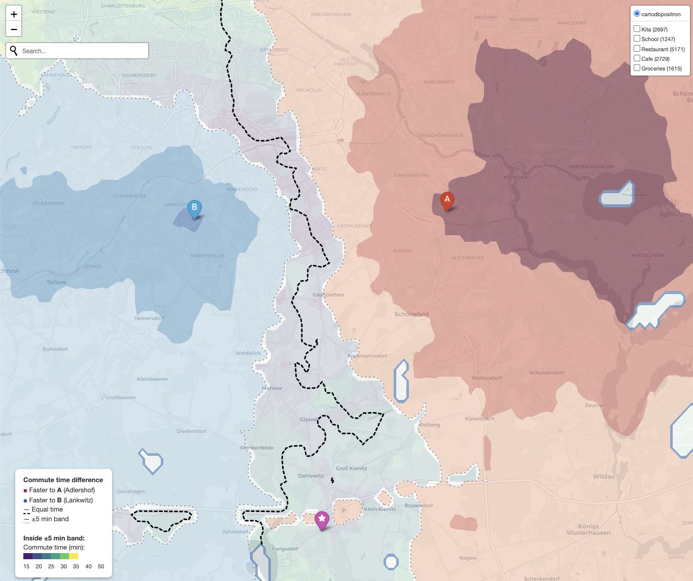

When two people in a household work in different parts of a city, picking
where to live is an optimization problem the usual house-hunting tools don't
solve. Single-origin isochrones are everywhere --- "20 minutes from this
address" --- but the thing I actually wanted to see was the set of
neighborhoods where *both* commutes come out roughly equal. So I wrote it.

The approach is straightforward:

1. Lay down a regular grid over the city's bounding box
2. Ask [OpenRouteService](https://openrouteservice.org/) (ORS) for driving
   time from every grid point to each workplace
3. Compute the scalar field `t_A − t_B`, extract the zero contour, and
   draw a ±5 min tolerance band on either side
4. Fill the rest of the map with a red↔blue gradient so you can also see
   *who* is faster by how much in the regions that aren't fair game

Inside the decision zone, a second viridis colormap shows the actual commute
time, so you can distinguish a 20-min equal-commute spot from a 40-min one.
On top, toggleable OSM overlays show kitas, schools, restaurants, cafes, and
supermarkets. Clicking a POI marker pops up driving, cycling, and walking
times to pinned addresses of interest.

{#fig-map}

## Gotchas worth writing down

**ORS snapping will lie to you.** When you send a grid point that lands in a
lake, a forest, or a military airfield, ORS doesn't return NaN --- it silently
snaps the point to the nearest routable road, possibly kilometers away, and
returns the travel time *from there*. The result is phantom contours wrapping
around Rangsdorfer See. The fix is to set `resolve_locations: true` in the
matrix request, read the returned `snapped_distance` per source, and drop any
grid point that got snapped more than ~400 m. In Berlin this removes ~13% of
the grid.

**Water is still worth masking explicitly.** Even after the snap filter, a
pass through the OSM `natural=water` polygons via Overpass catches everything
that slipped through (floating pontoons, narrow canals, edge cases) and
makes the logic obvious.

**Linear interpolation > cubic.** `scipy.interpolate.griddata` with
`method="cubic"` overshoots near sparse data and conjures up small closed
contours that look like artifacts because they are. Switching to `linear` and
tagging fine-grid cells too far from any valid source as no-data gives a
cleaner picture of where you have reliable data and where you don't. Forests
and airfields become visible gaps --- which is exactly what they should be.

**Cache everything.** First run is ~30s of ORS matrix calls, plus Overpass
POIs and water polygons. Every subsequent run is seconds because all the
expensive bits land in `.npz` / `.json` files fingerprinted by the config.
Refusing to cache empty results (which happens when Overpass mirrors fall
over) saves a lot of "why is my map blank" debugging.

## Links

The code is on GitHub and citable via Zenodo:

- Repo: [github.com/michaelaye/equal-commute](https://github.com/michaelaye/equal-commute)
- DOI: [10.5281/zenodo.19520780](https://doi.org/10.5281/zenodo.19520780)
- License: MIT

It's Berlin-specific in the default config, but the only things pinning it
to one city are the bounding box and the two workplace coordinates. If you
have the same problem in Munich or Paris, edit six lines.
