# Planet Four project {background-image="section1_APF0000hmm.png" background-opacity="0.85"}

## Science case {background-image="./PSP_003092_0985_RED.abrowse.jpg" background-size="contain"}

## Science case {background-image="./PSP_003092_0985_MIRB.abrowse.jpg" background-size="contain"}

## Science case temporal {background-image="image17.jpeg" background-size="contain"}

## Science case: Kieffer model
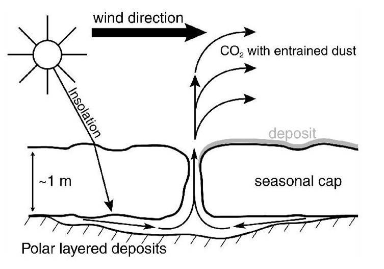

* Jet deposits are aligned by prevalent winds at the time!
* Mapping these features enables the first large area knowledge of prevailing winds on Mars!
  * on intra-seasonal timescales, not only over many years.

## Active areas around south pole
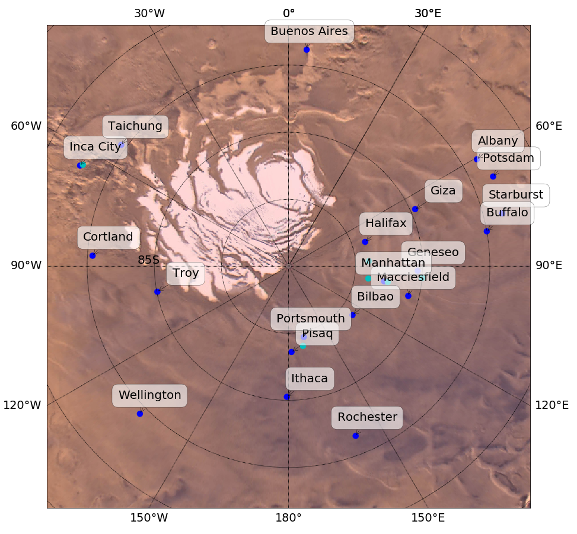

* Seasonal campaigns at most of these areas!
  * -> Lots of huge HiRISE image data

## Input data
* 221 HiRISE images from MY 29/30
  * new catalog: 469 studied images from MY 28-33 (6 years of data)
* split up into over 30,000 image screen-sized tiles
  * now over 64,000 tiles
* Tiles are being "anonymized", to prevent bias
* The data input and reduction pipelines need to track everything

## Interface {background-image="section3_marking_tools.png" background-size="contain"}

## Interface return
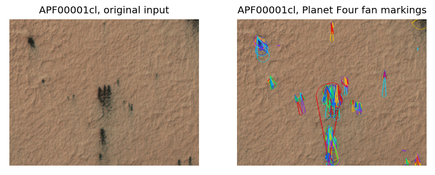

Minimum of 30 different volunteers per image tile!

=> quite slow progress

## Reduction pipeline {background-color="white"}
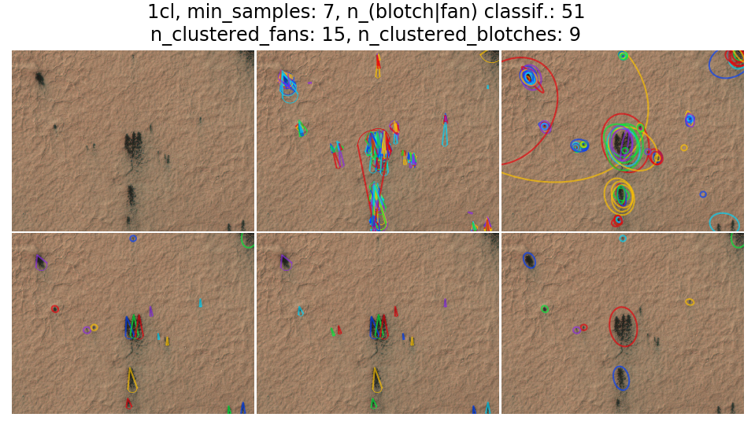

## Catalog entries
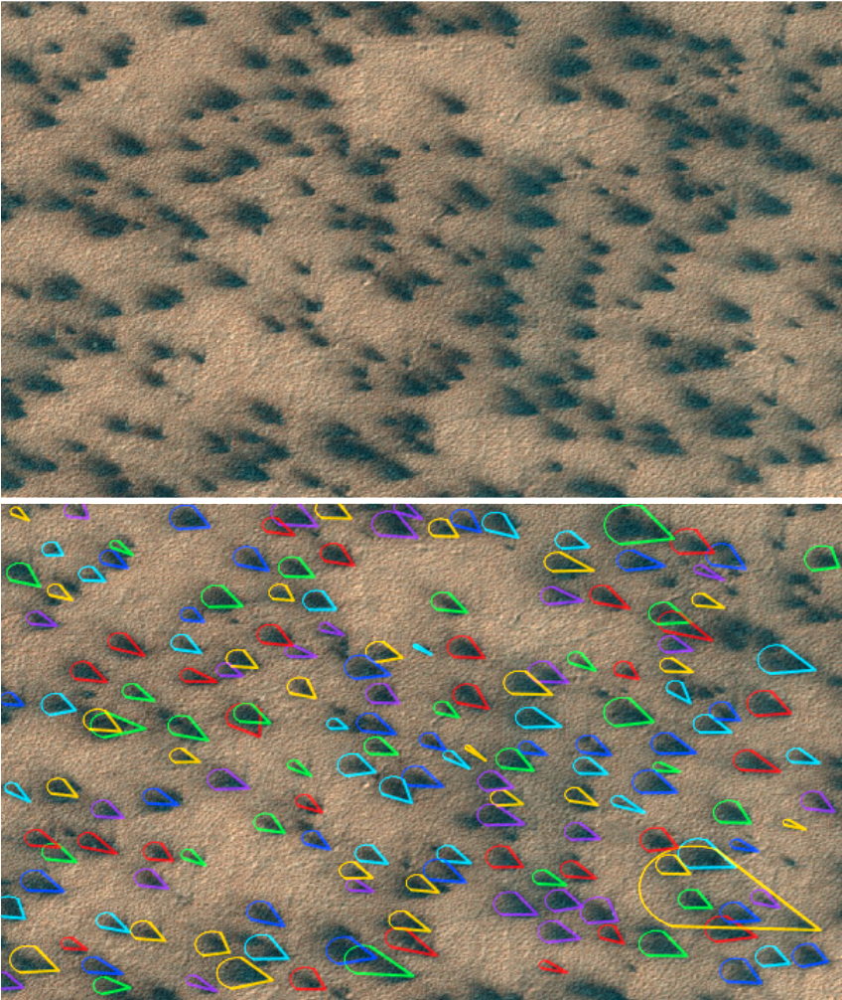{.absolute left=0}
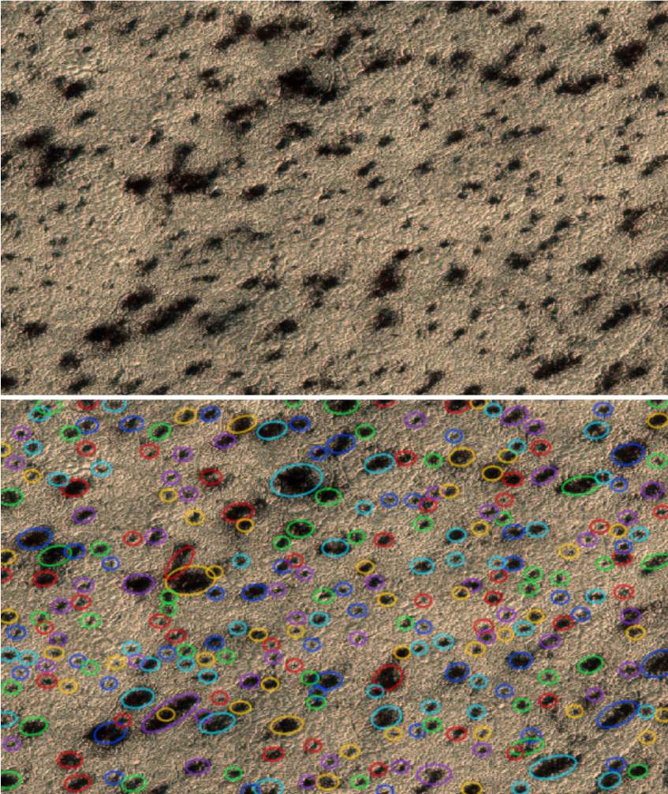{.absolute left=500}

<!-- ## Science Team (Gold) markings
* Each team member marked several hundred tiles
* Significant differences between science team members
* Years of experience do **not** overcome the original contrast problem!

## {background-image="gold_data114.png" background-size="contain"}

## Compare experts with citizens
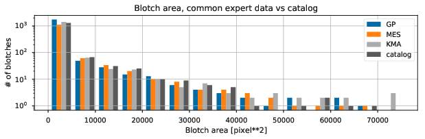 -->

## Results
* Over 40,000 citizens have contributed
  * Most only once
  * Core team of approx 10-20 volunteers did most of the work
* now over 690,000 geo-located objects in catalog
* available at zenodo "Planet Four Data Catalog" and via Python library "p4tools"

## What can be done with it?

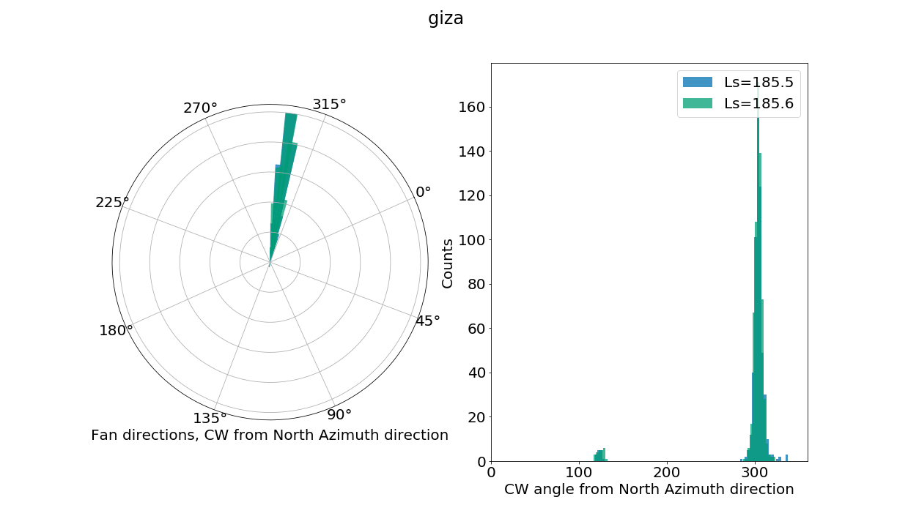

<!-- ## Compare with climate models 
* Team member Tim Michaels nest GCM into high-res meso-scale models using CTX and HiRISE DTM topography
* Run for several days to avoid "spin-up" effects
* Run at different $L_s$ over the season
* Compare wind predictions with Planet Four data
* Just published in @portyankinaPlanetFourDerived2022

## {auto-animate=true}
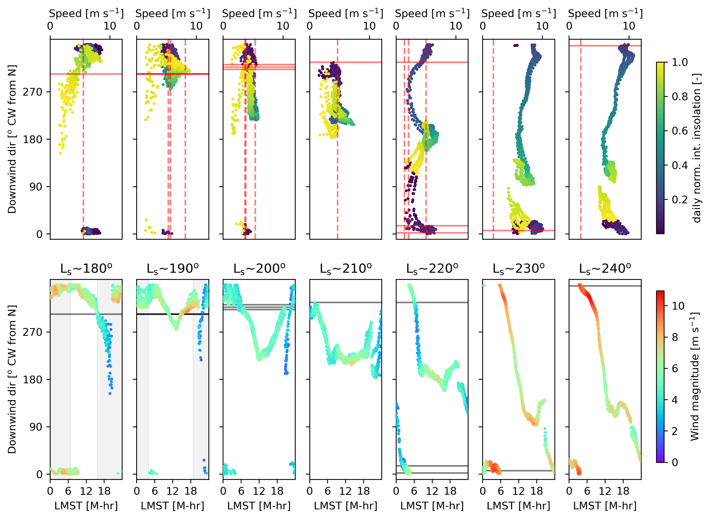{.absolute top=0 left=0 width=1000}

## {auto-animate=true}
{.absolute top=-250 left=0 width=1000}

<!-- ## Measure of success
* Define status of good / average / bad fit with data
* Using only direction very good match with climate models
* Taking into account wind strength as well less good
* Our assumptions for jet deposit <-> wind strength are too simple -->

## Covered surface interests

* Seasonal CO2 ice is quite bright
* So, how much is covered by dark regolith?
* -> energy balance of the surface and lower atmosphere 
* Previous work estimated 20-30% coverage, but only for a few locations and times

## Surface coverage across years

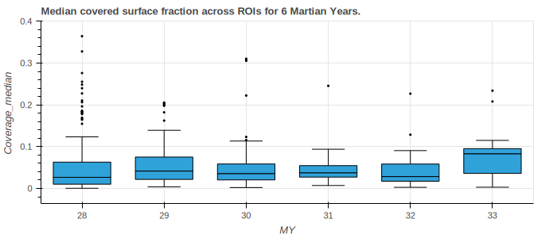

## Relationship to global dust storms?

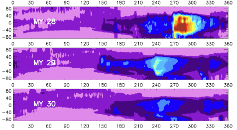
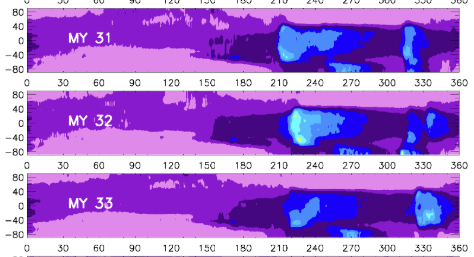
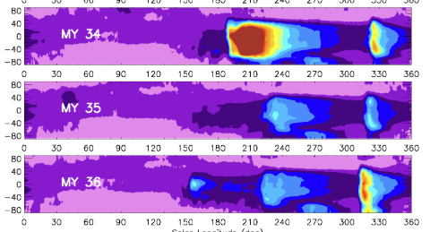

## Intra-seasonal variability

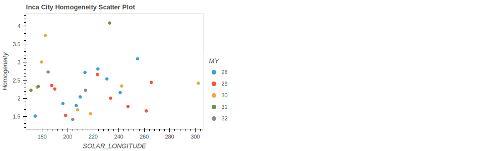
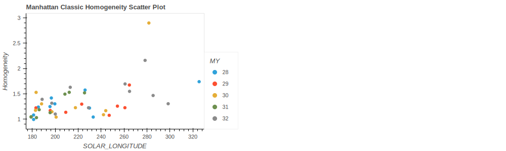

## Fan lengths
Combo of jet and wind strengths

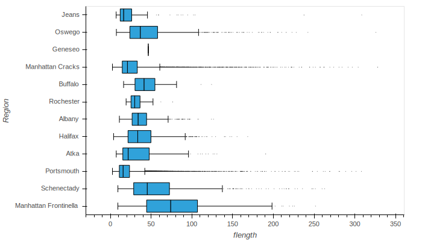

# Conclusions

- Surface coverage is very repeatable across years, but varies between ROIs
- Relationship to global dust storms is being investigated
- Surface coverage median fractions around 5 %.

# References
