## Outline {background-color="#004659"}

1. **Citizen science** — what it is, why it works
2. **Planet Four** — mapping CO~2~-jet deposits on Mars with 40 000 volunteers
3. **Surface coverage** — how much of the seasonal ice is darkened, and why it matters
4. **A cautionary tale** — how an "inter-annual trend" turned out to be a sampling artifact
5. **Where we go next** — a parallel albedo channel and an AI to scale it up

::: {.notes}
~60 s. Set expectations: this is a continuation of the EGU26 talk, but with room to breathe. The middle of the talk — the cautionary tale — is the part I most want the younger scientists in the room to take home. Roughly 45 min, leave time for questions.
:::

# I · Citizen Science {background-color="#004659"}

## What is citizen science, practically?

:::: {.columns}

::: {.column width="55%"}
- **Problem:** a simple but arduous, repetitive task — too much data to go through yourself
- **Solution:** split the task into screen-sized subtasks
- Present the data through a *simple workflow* to thousands of untrained volunteers
- Aggregate many independent judgements into one reliable measurement
:::

::: {.column width="45%"}
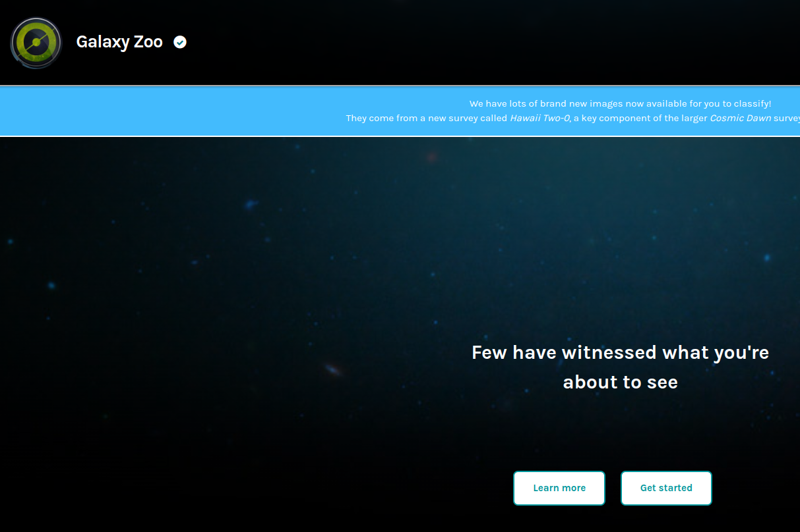{fig-align="center" width="100%"}
:::

::::

::: {.notes}
~90 s. The core idea in one slide. Emphasize: it only works for tasks that are *simple to explain* but *expensive to do at scale*. Pattern recognition on images is the canonical example. The aggregation step is where the science rigor lives.
:::

## What's in it for everyone?

:::: {.columns}

::: {.column width="50%"}
**For scientists**

- Data volume grows exponentially — humans don't scale
- Ideal for simple-but-arduous questions
- Labeled data is always better — CS is an efficient label factory for ML
- Genuine public-engagement opportunity
:::

::: {.column width="50%"}
**For citizens**

- Participate in *real* research
- Independent of prior education
- A wide variety of fields now offer CS projects
- A core community forms around shared goals
:::

::::

::: {.notes}
~60 s. Two-sided value proposition. The ML angle is increasingly the strategic one — and it comes back at the end of this talk. Note that a small core of dedicated volunteers typically does most of the work.
:::

## Origins — Zooniverse & Galaxy Zoo {background-image="figures/galaxyzoo.png" background-size="contain" background-opacity="0.25" background-color="#004659"}

- [**Zooniverse**](https://zooniverse.org) took off with **Galaxy Zoo** (2007) — classify galaxy morphology
- Dozens of papers *before* planetary science even joined
- Galaxy shape distributions had to be **redefined** thanks to volunteer classifications
- The platform now hosts hundreds of projects across every discipline

::: {.notes}
~60 s. Historical anchor: citizen science at internet scale is ~15 years old and already changed extragalactic astronomy. Planet Four is one of the planetary descendants. Keep it short — it's context, not the point.
:::

# II · Planet Four {background-color="#004659"}

## Planet Four — citizen science on Mars

:::: {.columns}

::: {.column width="55%"}
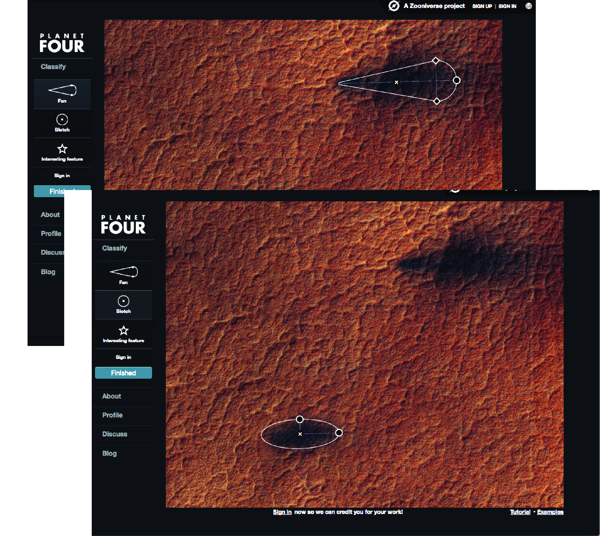{fig-align="center" width="100%"}
:::

::: {.column width="45%"}
- Zooniverse-hosted volunteer mapping; **40 000+ classifiers**
- Volunteers outline **fans** (directional CO~2~-jet deposits) and **blotches** (elliptical) on HiRISE south-polar tiles
- Six Mars Years (MY 28–33) — **469 obs · 64 494 tiles** [@ayePlanetFourProbing2019]
- Each tile seen by **≥ 30 independent volunteers** before it counts
:::

::::

::: {.notes}
~90 s. Anchor numbers: 6 Mars Years, 64 k tiles, 40 k volunteers, ~690 k features. Left image: the P4 marking interface, stacked. The 30-volunteers-per-tile rule is what makes the aggregation statistically meaningful — and what makes progress slow.
:::

## Science case — the Kieffer cold-jet model {background-image="figures/science_case_bg.jpeg" background-size="cover" background-position="center" background-color="#004659" background-opacity="0.55"}

:::: {.columns}

::: {.column width="50%"}
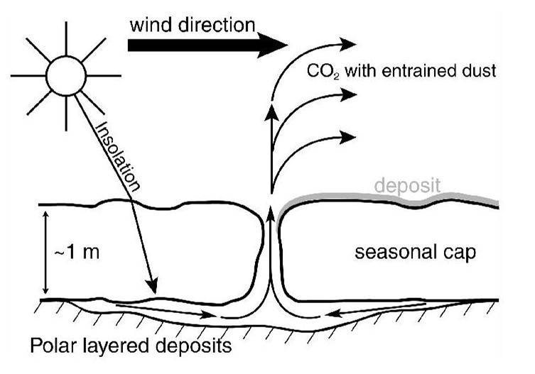{fig-align="center" width="100%"}
:::

::: {.column width="50%"}
- Spring sublimation of translucent CO~2~ slab ice → high-pressure gas vents through cracks
- Subsurface regolith is ejected onto the bright seasonal ice as **fan / blotch deposits**
- Fan shape is **aligned with the prevailing wind** at the moment of eruption [@kieffer2007cold; @portyankinaPlanetFourDerived2022]
:::

::::

::: {.notes}
~90 s. The mechanism. Gas pressure under translucent ice → vent → dust ejected → the fan shape encodes wind direction (and, we hoped, strength). This is *why* mapping these deposits is scientifically valuable: more wind data than we have ever had on Mars.
:::

## What volunteers map → wind data

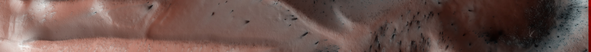{fig-align="center" width="100%"}

:::: {.columns}

::: {.column width="52%"}
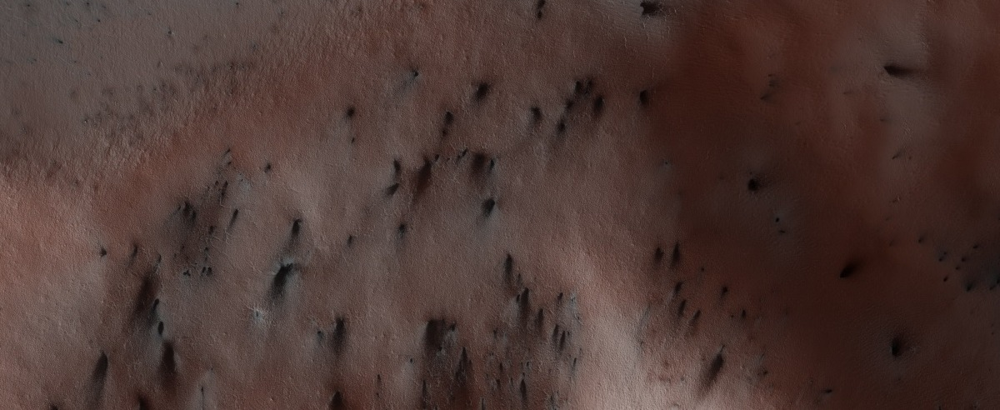{fig-align="center" width="92%"}
:::

::: {.column width="48%"}
- **Fans:** directional — angle, length, spread → a **wind vector**
- **Blotches:** elliptical — no clear direction
- A season of fans = **wind measurements** at hundreds of sites
- *"More wind data than we've ever had on Mars"* — a **known point in the season** (to ~day precision via the imaging sequence), but never the *time* of day
:::

::::

::: {.notes}
~75 s. Make the link explicit: each fan is, in effect, an in-situ wind measurement at the surface. Top: the full HiRISE RGB strip (PSP_003092_0985). Bottom-left: a zoom into the fan field — every dark fan is elongated in the same direction, and that consistent orientation *is* the wind signal.

State the caveat out loud: we know the **season** (L~s~ at the time of imaging), but **not the local time of day** each jet erupted. Depending on local topography, surface winds at a site can shift through the day, so each fan samples an unknown moment. That ambiguity limits how tightly we can match the fans to GCM / mesoscale wind predictions — and it contributes to why direction matches the models well while inferred strength does not.
:::

## Wind directions — sharp and repeatable

:::: {.columns}

::: {.column width="58%"}
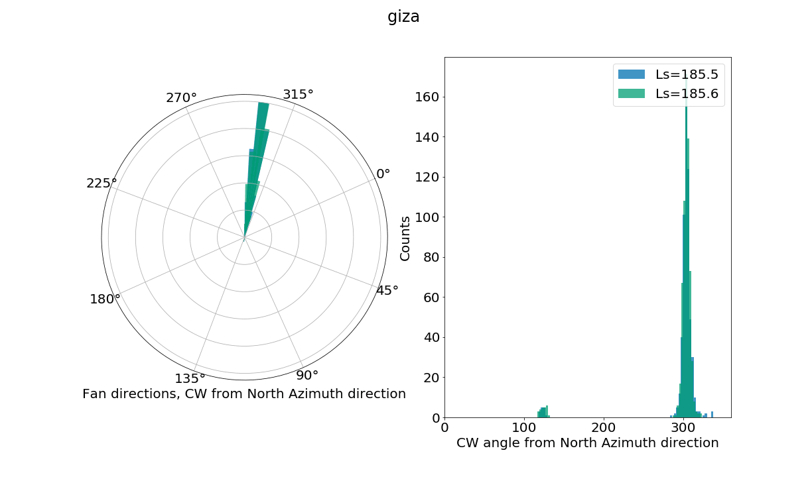{fig-align="center" width="100%"}
:::

::: {.column width="42%"}
- Each observation's fan directions form a **razor-sharp peak** (here ~305°, NW)
- Two observations at the *same* season **coincide** — L~s~ 185.5° vs 185.6° lie on top of each other
- The seasonal rotation is **orderly**, and consistent across the two Mars Years analysed (MY 29–30) [@ayePlanetFourProbing2019]; reproduced by mesoscale models [@portyankinaPlanetFourDerived2022]
- **This** is the most direct usable product: *direction* — while area or count are harder to interpret.
:::

::::

::: {.notes}
~75 s. The evidence behind the "two-tier reliability" claim that pays off on the contrast slide and in the conclusion. Left: an animation of fan-direction distributions at Giza, one colour per HiRISE observation, accumulating as the season (L~s~) advances.

Two points: (1) **Sharpness & repeatability** — each distribution is a tight peak, and the two earliest observations (L~s~ 185.5 and 185.6) sit exactly on top of each other: independent measurements of the same wind give the same answer. (2) **Orderly seasonal change** — the peak rotates smoothly from ~305° (NW) early season toward ~0–10° (N) by L~s~ 224; the wind regime evolves, but predictably.

Aye et al. (2019) found this pattern consistent across the two Mars Years monitored; Portyankina et al. (2022) reproduced it with MRAMS mesoscale winds. So *directions* are the robust product — which is exactly why I keep area and count separate when I get to coverage.
:::

## Active regions around the south pole

:::: {.columns}

::: {.column width="60%"}
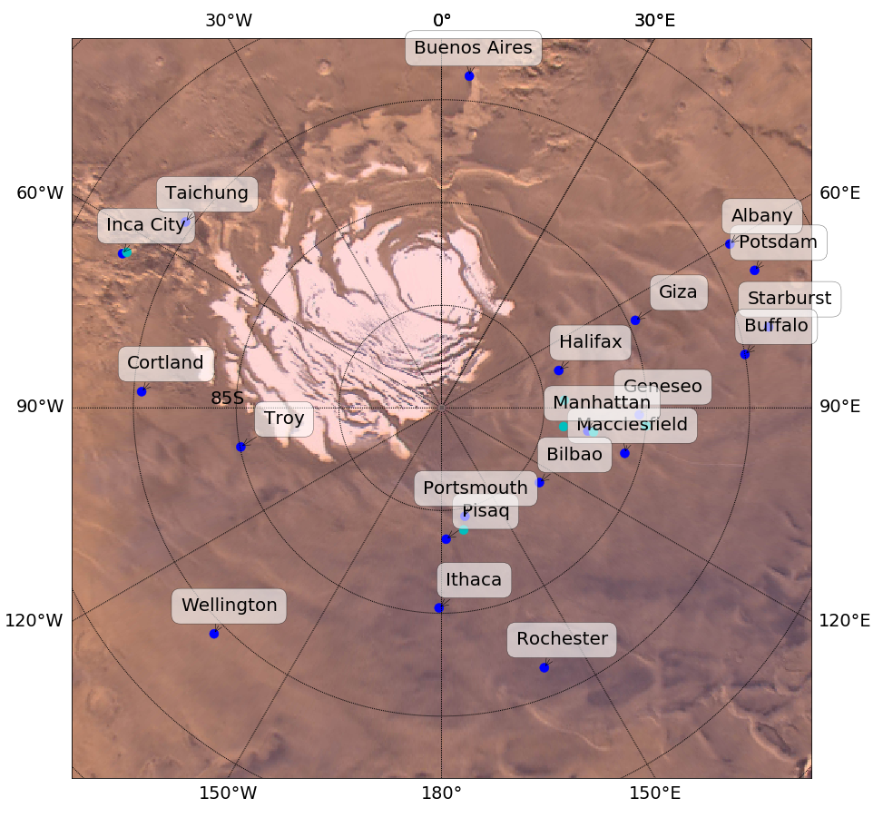{fig-align="center" width="100%"}
:::

::: {.column width="40%"}
- A **HiRISE observation** = one multi-filter image at one place and time
- A **ROI** = a region of interest, re-imaged over years — but at **very uneven time sampling**
- Seasonal campaigns at **~25 ROIs**; enormous HiRISE data volume → the need for citizen science
- **Remember this map** — the *uneven* sampling across ROIs and years is the punchline later
:::

::::

::: {.notes}
~75 s. Plant the seed. The ROIs are not sampled uniformly — some have many Mars Years, some only one or two. Tell the audience to hold that thought; it returns in the cautionary tale.
:::

## From classifications to a catalog

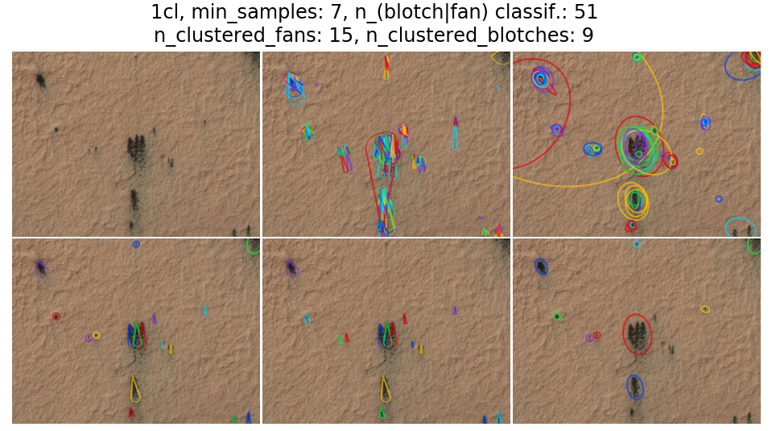{fig-align="center" width="62%"}

::: {.notes}
~90 s. The reduction pipeline is where rigor is enforced: DBSCAN clustering of fans and blotches separately, then "fnotching" to resolve ambiguous markings by vote ratio, then a cut threshold. Volunteers give raw clicks; the pipeline gives a defensible catalog. White background so the diagram reads.
:::

## Experts vs. citizens — the contrast problem

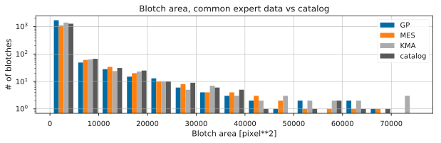{fig-align="center" width="88%"}

:::: {.columns}

::: {.column width="50%"}
- Each science-team member ("gold" data) marked several hundred tiles
- **Significant disagreement** *between experts* too
:::

::: {.column width="50%"}
- Experience does **not** overcome the core ambiguity: *what contrast defines a feature's edge?*
- Aggregated citizens **track the experts** — the crowd is not the weak link
:::

::::

::: {.fragment}
**What carries error — and what doesn't:** covered *area* and deposit *counts* inherit this edge ambiguity, but a fan's measured **wind direction is sharp and reliable.**
:::

::: {.notes}
~75 s. Honest about the limits. The hard problem is not "amateurs vs professionals" — it is that the deposit edge is genuinely fuzzy. Experts disagree with each other. So aggregating many volunteers is a reasonable, well-calibrated estimator, not a compromise.

Drive the framing home before we move to coverage: because the edge is fuzzy, the *quantitative* products — covered area (→ coverage fraction) and deposit counts — carry real uncertainty. But the *directional* product does not: a fan's orientation is unambiguous even when its exact extent is not, so the wind directions we derive are sharp and reliable. Keep this two-tier reliability in mind for the coverage numbers that follow.
:::

## Results — the v3.1 catalog, open & reachable

- Over **40 000** volunteers contributed; a core of ~10–20 did most of the work
- **64 494 tiles · 469 HiRISE observations · MY 28–33 · ~25 ROIs**
- Open release on **Zenodo** as part of the *Planet Four Data Catalog*

### Two lines of Python via `p4tools`

```python
from p4tools import io
fans = io.get_fan_catalog(version="v3.1")
```

::: {.notes}
~75 s. The deliverable: a citable, openly redistributable catalog plus a pip-installable access library. This is what makes the coverage analysis in the second half reproducible by anyone in the room. Transition slide into Part III.
:::

# III · Surface Coverage {background-color="#004659"}

## Why surface coverage matters

- Fresh CO~2~ ice albedo **0.6–0.8**; deposited regolith **≲ 0.2**
- Coverage **directly modulates** the seasonal-cap energy balance, sublimation rate, and jet feedback
- Modellers want a *number*
- The canonical **20–30 %** [@Piqueux2003] is *within the active cryptic terrain* — **not** a cap-wide mean
- Planet Four lets us replace the folklore number with a measured distribution

::: {.notes}
~90 s. The motivation for the whole coverage effort. The widely-quoted 20–30 % is real but local to cryptic terrain; people misuse it as a global average. Our dataset can finally give a defensible distribution. Set up the histogram next.
:::

## How we measure coverage

:::: {.columns}

::: {.column width="52%"}
**Per-tile fractional coverage** (method by Tom Ihro)

1. Each fan/blotch entry → a Shapely **polygon** in HiRISE pixel coordinates
2. Coverage = **union area of all polygons ÷ tile area**
3. Aggregate per observation: **median, IQR, std** across its tiles
:::

::: {.column width="48%"}
- Per-tile table: **64 494 tiles / 469 obs**
- ROI labels via `p4tools.io.get_region_names()`
- Computed in **pixel space** (not ground-projected) — small effect at similar latitudes
- 10° L~s~ bins balance time resolution vs. sample size
:::

::::

::: {.notes}
~90 s. Methodology, kept tight. The union-of-polygons step matters: overlapping fans don't double-count. Median (not mean) across tiles because the per-tile distribution is heavily skewed. Caveat the pixel-space choice up front so nobody asks later.
:::

## Overall coverage statistics

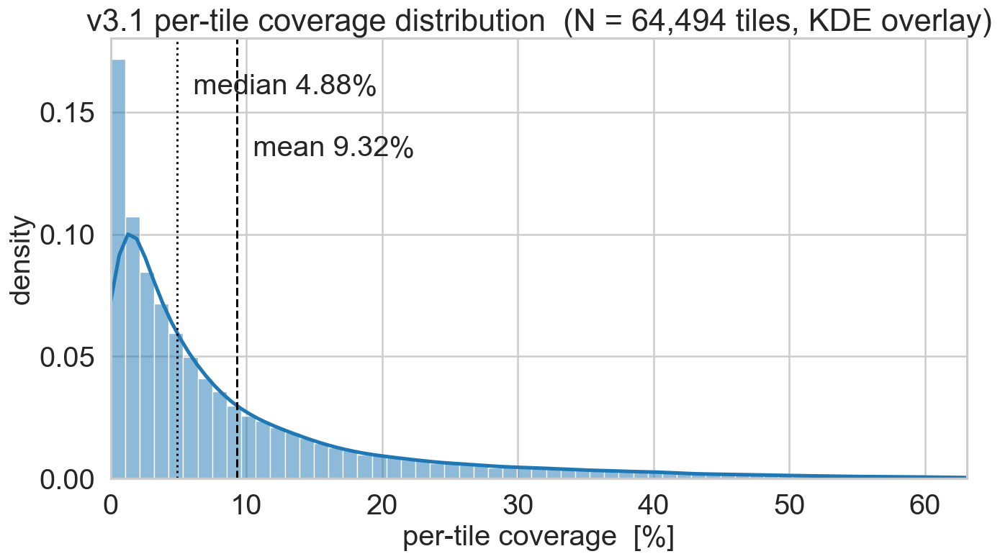{fig-align="center" width="78%"}

::: {.fragment}
- Cap-wide median **4.88 %** · mean **9.32 %**
- Heavy right tail past 30 % — but only a small minority of tiles
:::

::: {.notes}
~90 s. The headline number. Most tiles carry only a few percent; the right tail brushes 30 % but those are rare. The mean/median gap is the signature of the skew — quote the median as the honest central value. The 20–30 % figure as a *cap-wide* mean is simply wrong.
:::

## Inter-annual — the distribution repeats

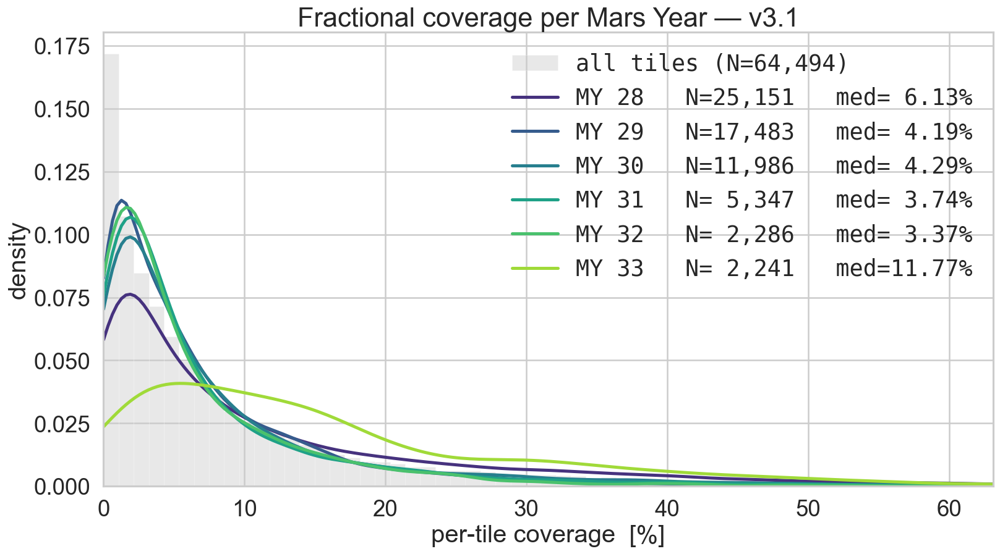{fig-align="center" width="82%"}

::: {.fragment}
Distribution shape is **strikingly repeatable** across MY 28–32. So far, so reassuring…
:::

::: {.notes}
~90 s. One KDE per Mars Year over the cap-wide background. The eye sees the repeatability immediately. End on a deliberately reassuring note — because the next section is going to complicate it. This is the pivot into the cautionary tale.
:::

# IV · A Cautionary Tale {background-color="#004659"}

## An apparent trend across Mars Years

:::: {.columns}

::: {.column width="60%"}
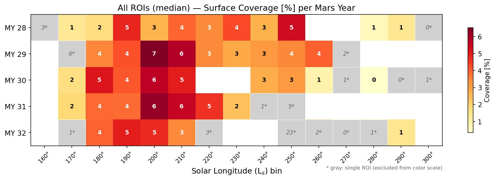{fig-align="center" width="100%"}
:::

::: {.column width="40%"}
- Aggregate everything: **median coverage across all ROIs**, per (MY × L~s~) bin
- The most recent Mars Year looked **different** — a tempting "inter-annual trend"
- It is easy to say here: *"coverage trends are changing year over year"*
:::

::::

::: {.notes}
~90 s. This is the trap, presented exactly as we first saw it. We aggregated across ROIs to get one tidy number per year, and the latest Mars Year stood out. The honest first reaction was: a trend! A climate signal! Pause here — let the audience feel the pull of that interpretation before you pull the rug.
:::

## The catch — who was actually sampled?

:::: {.columns}

::: {.column width="46%"}
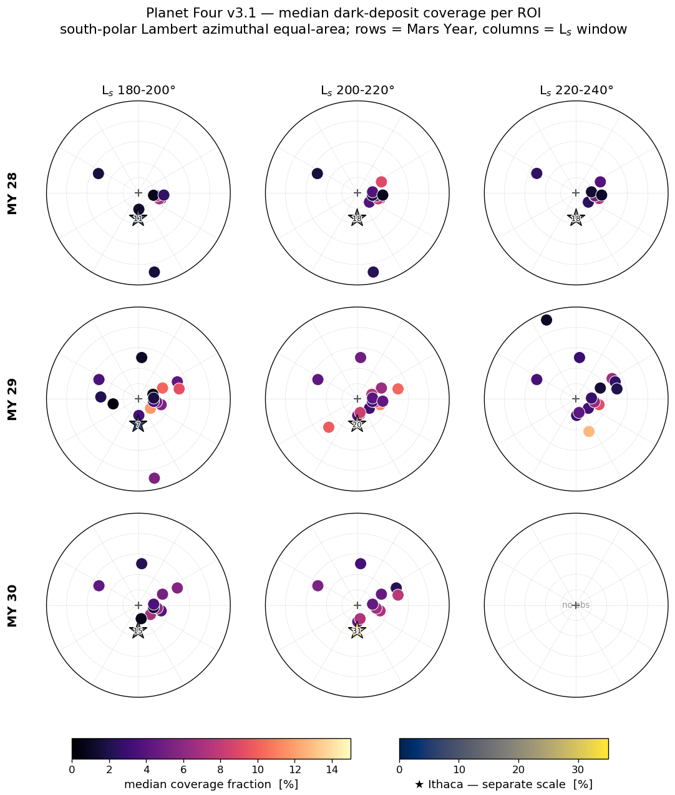{.nostretch fig-align="center" width="86%"}
:::

::: {.column width="54%"}
- Each panel is a south-polar map — one dot per ROI, **coloured by median coverage**
- **MY 28–30: richly sampled** — 16–25 ROIs each, dots across the whole pole
- This is the regime our intuition is calibrated on…
- …now watch what happens to the sampling in the *later* Mars Years →
:::

::::

::: {.notes}
~75 s. Set up the trap with the well-sampled years. MY 28–30 each have 16–25 ROIs spread across the cap — plenty to average over. Tell the audience to hold the picture of "dots everywhere" in mind, because the next slide pulls it away. Same figure, split top/bottom only so the maps are readable.
:::

## …and then the sampling collapses

:::: {.columns}

::: {.column width="46%"}
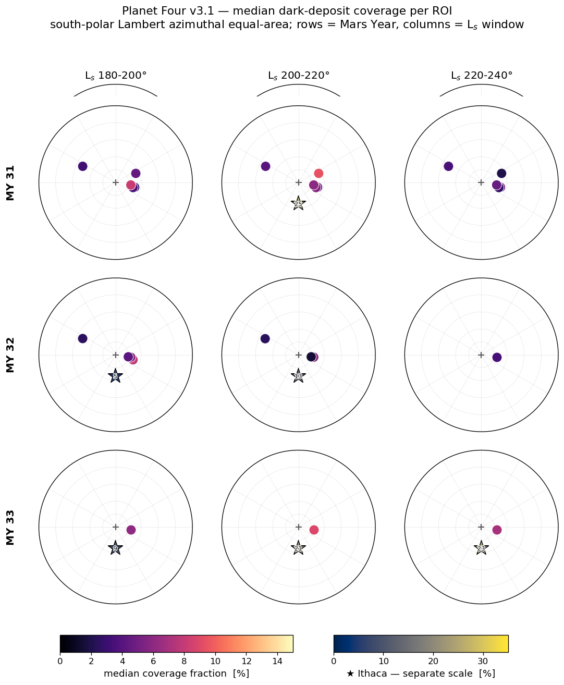{.nostretch fig-align="center" width="86%"}
:::

::: {.column width="54%"}
- ROI count falls over the mission: **16 → 25 → 16 → 7 → 6 → 2**
- **MY 33: almost empty** — only **2 ROIs** (13 observations), one of them **Ithaca, the 10× outlier (★)**
- So the MY 33 "all-ROI average" is really *"Ithaca and one neighbour"* — **not comparable** to years built from 16–25 regions
- The apparent inter-annual trend was **composition, not climate**
:::

::::

::: {.notes}
~120 s. The reveal. The observation-vs-ROI distinction does real work: MY 33 has a respectable **13 HiRISE observations**, which *feels* like enough data — but they fall in only **2 ROIs** (Ithaca + Manhattan Classic). The apparent inter-annual change was a *composition* effect: the cross-ROI average is dominated by *which* regions happened to be imaged, and MY 33 happens to include Ithaca, the ~10× outlier. Earlier years average 16–25 regions; MY 33 averages 2. Textbook Simpson's paradox. (Numbers verified from `region_names_v3.1.csv`.)
:::

## The fix — read it within each ROI

:::: {.columns}

::: {.column width="50%"}
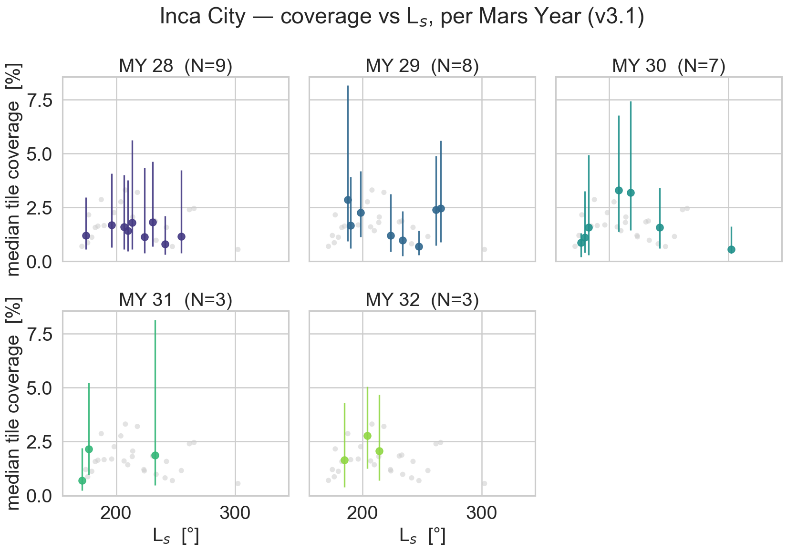{fig-align="center" width="100%"}
:::

::: {.column width="50%"}
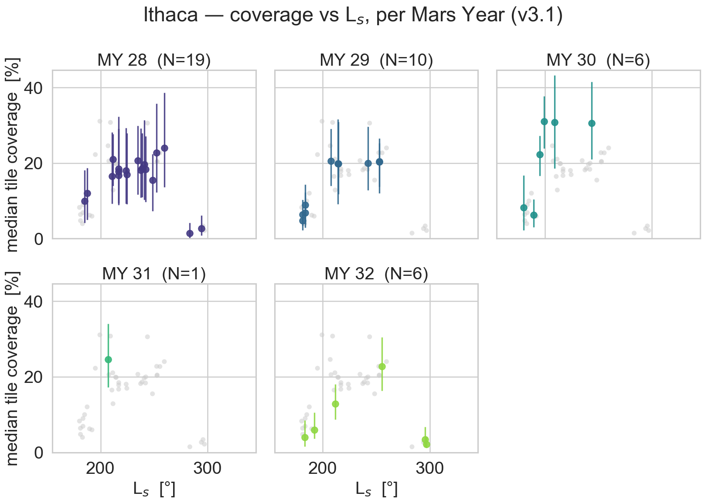{fig-align="center" width="100%"}
:::

::::

**Inca City** (low, canonical) vs **Ithaca** (~10× higher). Compare *within* a region across years — never pool across regions that differ this much.

::: {.notes}
~90 s. The correct analysis: hold the ROI fixed, look across Mars Years inside it. Each panel highlights one year with IQR error bars; faint grey is the other years. Within a region, coverage is far more stable than the bogus all-ROI "trend" suggested. The between-ROI spread (Inca City vs Ithaca) is the dominant axis of variation in the whole dataset — bigger than any inter-annual effect.
:::

## Ithaca up close — why it's the outlier

:::: {.columns}

::: {.column width="58%"}
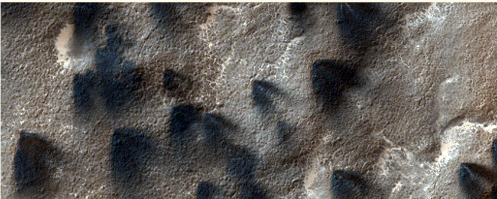{.nostretch fig-align="center" width="100%"}
:::

::: {.column width="42%"}
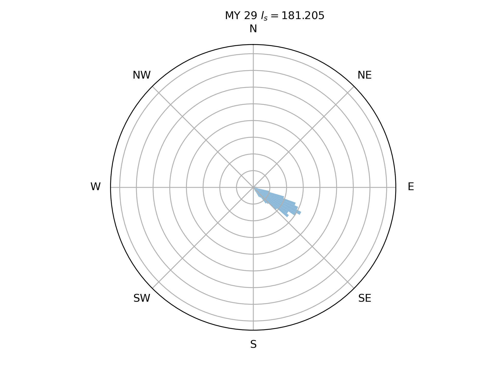{.nostretch fig-align="center" width="80%"}
:::

::::

Ithaca's ice is **carpeted** with large fans → **~10×** a typical ROI's coverage. Same physics, *extreme* expression — **keep it separate** in any cross-ROI aggregate.

::: {.notes}
~75 s. Make the outlier physical. The earlier slides said "Ithaca is ~10× typical" as a number on a heatmap — this is what that number looks like on the ground: a HiRISE subframe of Ithaca's seasonal ice densely covered by large, often overlapping dark fans, each one a CO~2~-jet deposit. This is why Ithaca dominates any cross-ROI average and why MY 33 — which only sampled Ithaca and Manhattan Classic — looked anomalous. Same jet mechanism as everywhere else, just an unusually productive site. Right: the fan directions accumulating through the season — all blown the same way.
:::

## A short ROI tour

:::: {.columns}

::: {.column width="50%"}
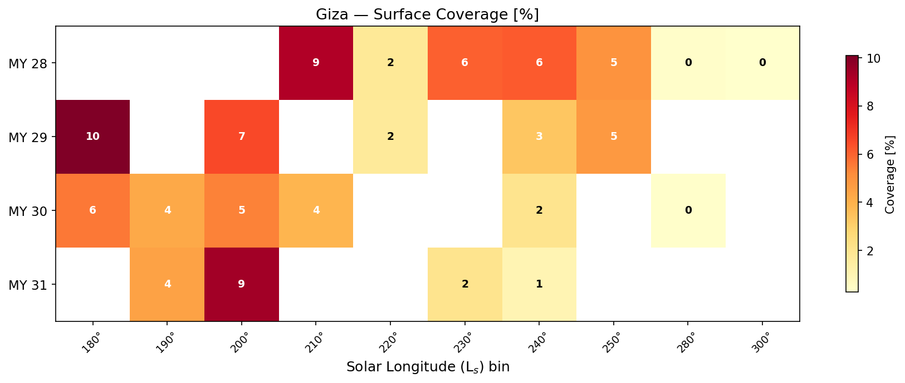{fig-align="center" width="100%"}
:::

::: {.column width="50%"}
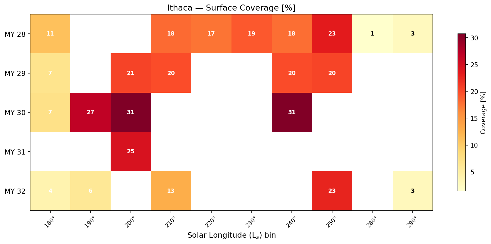{fig-align="center" width="100%"}
:::

::::

Per-ROI (MY × L~s~) heatmaps. **Ithaca is the outlier** (~10× typical) — it must be treated separately in any cap-wide aggregate.

::: {.notes}
~75 s. A couple of concrete per-ROI heatmaps so the audience sees real structure: the seasonal rise within a year is the strong, repeatable signal; the year-to-year differences within one ROI are modest. Ithaca's magnitude is why pooling it with others poisons the average. Optionally flip through a few more live from the review document.
:::

## What we did next: match ROI + L~s~ — but first, the same ground?

:::: {.columns}

::: {.column width="50%"}
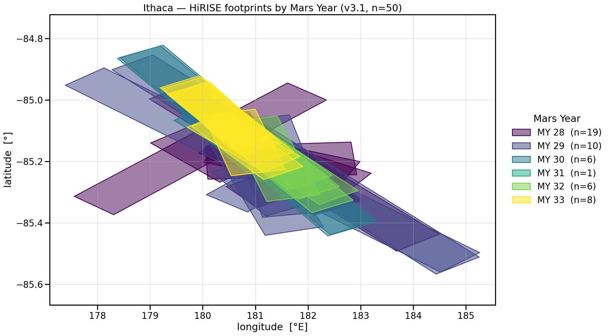{.nostretch fig-align="center" width="100%"}
:::

::: {.column width="50%"}
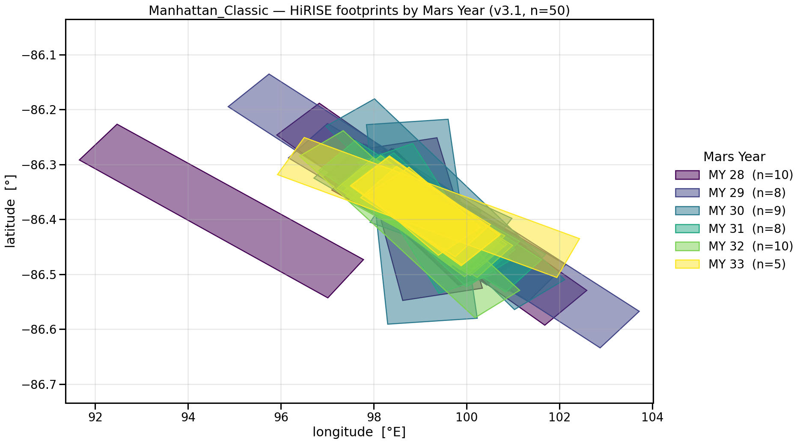{.nostretch fig-align="center" width="100%"}
:::

::::

**All six Mars Years' footprints pile onto the same patch** — MY 33 (yellow) right in the middle. Comparing years *within* a ROI compares the **same ground**, not different terrain.

::: {.notes}
~75 s. The safeguard our internal group insisted on *before* trusting any within-ROI year-to-year claim: do the HiRISE observations from different Mars Years actually cover the same ground? Footprints come from the RDR index (CORNER lat/lon), coloured by Mars Year. They pile onto the same lat/lon patch at both ROIs, MY 33 (yellow) included. *That* is the licence to compare MY 33 against MY 28–32 within a ROI: same place, different year. Without this check a "year effect" could just be a "looked-somewhere-else effect." This is the first of the slides from my internal anomalies deck.
:::

## MY 33 — more eruptions everywhere, calm wind only at Ithaca

![Ithaca vs Manhattan Classic — fans/obs (blue) & blotches/obs (red) per Mars Year, matched L~s~ ∈ [180°, 240°]](figures/diag_my33_locality.png){.nostretch fig-align="center" width="74%"}

::: {.fragment}
- Restrict to the **same two ROIs** MY 33 actually sampled, same L~s~ — compare *like with like*
- **MY 33 activity ≈ ×2 in *both* ROIs** → more eruption events: plausibly a **shared / global** driver
- But the **fan → blotch flip is *only* at Ithaca** → unusually **calm local wind**, so ejecta drops as blotches, not wind-shaped fans
- A **hypothesis to test**, not a cap-wide trend — *this* is the payoff of stratifying properly
:::

::: {.notes}
~120 s. The redemption — and the constructive half of the lesson. Having killed the cap-wide artefact, we ask: restrict every Mars Year to the *exact* two ROIs MY 33 has (Ithaca + Manhattan Classic), in the same L~s~ window, and compare like with like. Two things emerge: (1) total marking rate ≈ ×2 typical in **both** ROIs (Ithaca ×2.04, Manhattan ×2.22) — a *shared* "more eruptions" signal, plausibly global. (2) The fan/blotch ratio collapses (fan_fraction 0.63 → 0.18) **only at Ithaca** — a *local* calm-wind anomaly: with little wind to shape them, the ejecta settle as blotches. Manhattan Classic, same MY 33, keeps a normal fan/blotch ratio — confirming the calm-wind part is local, not global. These are genuine, physically-readable hypotheses — exactly what proper stratification buys you. (Source: matched-ROI / matched-L~s~ re-analysis, v3.1 catalog.)
:::

## MY 31 Manhattan Classic — stronger, more directional wind

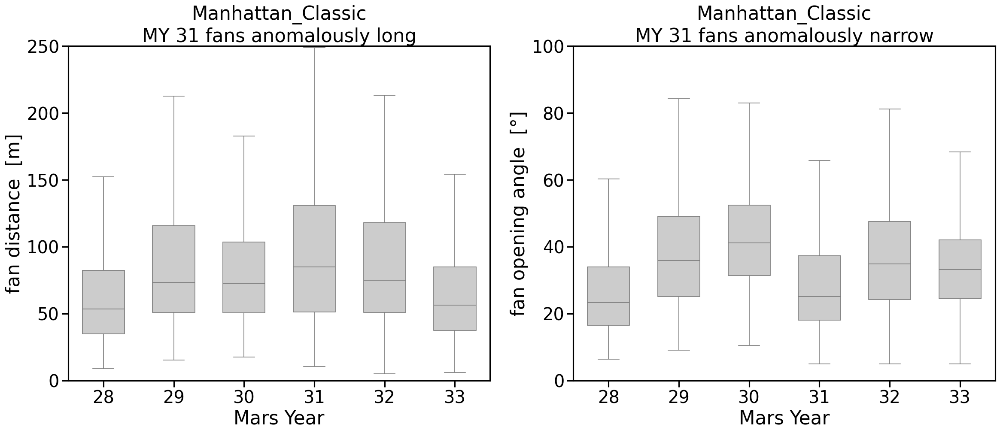{.nostretch fig-align="center" width="80%"}

::: {.fragment}
- MY 31 fans **~24 % longer** *and* **~26 % narrower** than the MY 28–32 cluster
- That year's activity sits at the **low** end → **fewer eruptions, each under stronger, more directionally-focused wind**
- Another single-(MY × ROI) signal — local, physical, **testable**
:::

::: {.notes}
~90 s. Second matched-ROI finding. 6 obsids in matched L~s~ ∈ [180°, 240°]; fan distance ×1.24, opening angle ×0.74 vs the MY 28–32 cluster. Total marking rate at the low end of typical (217 markings/obs) — so *fewer events*, but each captures *stronger and more directionally stable* surface wind during MY 31's fan-forming episodes at Manhattan Classic. A clean, opposite-sign companion to the MY 33 Ithaca calm-wind story.
:::

## MY 32 Ithaca — a coverage shape-shift (suggestive)

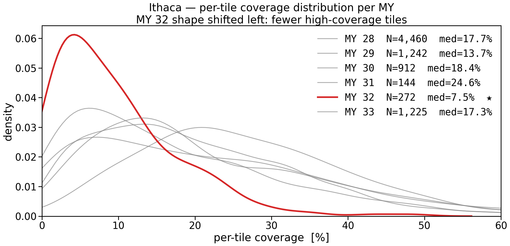{.nostretch fig-align="center" width="78%"}

::: {.fragment}
- MY 32's per-tile coverage piles up at **low** values — median **7.5 %** vs the typical **14–18 %**
- **Fan geometry stays normal** (distance, spread, fan-fraction all typical) → a *tile-coverage* shape shift, not a fan effect
- Only **3 observations** → flagged **suggestive**: a target for follow-up once more MY 32 Ithaca data arrive
:::

::: {.notes}
~75 s. The fourth — and weakest — signature, included for honesty. 3 obsids only (N = 272 tiles), so suggestive, not firm. The per-tile coverage distribution shifts left: median 7.5 % vs typical 13.7–18.4 %; only ~38 % of tiles reach ≥ 10 % coverage versus the typical 60–89 %. Crucially the fan-side numbers (distance, spread, fan-fraction) are all typical — so this is a change in how coverage is *distributed across tiles*, not a fan-geometry effect. Flagged as a study target once more MY 32 Ithaca observations exist. Naming a weak signal honestly, with its caveat, models exactly the practice this talk is about.
:::

## Four signatures, four readings {.smaller}

| MY × ROI | n | Signature | Physical reading |
|---|--:|---|---|
| **MY 31 Manhattan Classic** | 6 | fans ×1.24 longer · ×0.74 narrower · low activity | stronger, more directional wind |
| **MY 33 Ithaca** | 5 | activity ×2.04 · fan-fraction 0.63 → 0.18 | more eruptions (shared) + **calm local wind** → blotch surge |
| **MY 33 Manhattan Classic** | 5 | activity ×2.22 · fan/blotch ratio normal | more eruptions (shared) + normal wind → calm wind is **local to Ithaca** |
| **MY 32 Ithaca** | 3 | tile-coverage shifted low | *suggestive* — needs more observations |

::: {.fragment}
**MY 33 across both ROIs:** the ×2 activity is **shared** (a candidate *global* driver); the fan→blotch flip is **local to Ithaca** (a *local* wind anomaly). Every one of these stays hidden until ROI **and** L~s~ are matched.
:::

::: {.notes}
~90 s. The synthesis from the internal deck. All four signatures are confined to a single (MY × ROI) cell — none extend cap-wide, which is exactly why the naive all-ROI average manufactured a false trend. Two are robust (n = 5–6 observations); MY 32 Ithaca is flagged suggestive only (n = 3). The point for the talk: admitting the EGU artefact did not leave us empty-handed — proper stratification turned one fake trend into four concrete, physically-readable hypotheses worth chasing. That is *progress*, bought by a mistake — which sets up the closing slide.
:::

## The lesson — heterogeneous datasets

> An **average over a heterogeneous, unevenly-sampled population** is not a measurement — it is an artifact of the sampling.

- **Check the n behind every aggregate cell** before you read a trend into it
- A change in a pooled statistic can be **pure composition change** (Simpson's paradox)
- Stratify first: verify the signal **within** each stratum, in **every** stratum
- Only aggregate across strata you have shown to be comparable

::: {.notes}
~120 s. The take-home for the younger scientists. Say it plainly: we almost reported an inter-annual trend that was really "we imaged different places that year." The discipline that saves you is boring — always look at the per-stratum sample size, always check whether the same subgroups are present before and after. This habit generalizes far beyond Mars. This is the slide I most want them to remember.
:::

# V · Where We Go Next {background-color="#004659"}

## Off-active darkening — a parallel channel

- Beyond discrete fans/blotches, the **background** CO~2~ ice darkens *diffusely*
- Mechanism: a thin homogeneous dust mantle from lighter grains carried by wider jet activity [@Pommerol2011]
- Photometric quantification (north cap) by [@Portyankina2013]; recent N–S synthesis [@Hansen2024]
- **Planet Four does not capture this** — it is a *parallel* contribution to the seasonal albedo budget

::: {.notes}
~75 s. Important caveat for any modeller using our numbers: P4 measures the discrete deposits, not the diffuse darkening. A complete albedo budget needs both channels. Be explicit so nobody over-reads the coverage fraction as the *total* darkening.
:::

## Conclusions {background-image="figures/conclusions_bg.jpg" background-size="cover" background-position="center" background-color="#004659" background-opacity="0.5"}

- **Two-tier reliability:** wind *directions* are sharp & reliable; coverage *area* and deposit *counts* carry real uncertainty
- v3.1 catalog is **openly redistributable** (Zenodo + `p4tools`)
- Cap-wide coverage: median **4.88 %**, heavy right tail — *not* the folklore 20–30 %
- Within-ROI distributions **repeat** across MY 28–33
- **Beware the all-ROI average** — uneven ROI sampling fakes inter-annual trends
- Combine with **off-active darkening** for a complete albedo budget
- **Now training an AI on P4 labels** to extend coverage from the colour strip to the **5× larger RED channel**

::: {.notes}
~90 s. The slide they photograph. Hit the three results, the one methodological warning (our cautionary tale, now distilled to a bullet), and the forward look. The ML model trained on Planet Four labels will let us run this coverage analysis on the much wider RED-channel HiRISE data — roughly 5× the area of the colour strip.

Verbal acknowledgments: 40 000+ Planet Four citizen scientists; HiRISE / LPL; Zooniverse; co-authors (Tom Ihro, Ganna Portyankina, Candice Hansen, Megan Schwamb, Tim Michaels); funding sources. Background is PSP_003092_0985 at 0.5 opacity over dark blue.
:::

## One last thing — for the students {background-image="figures/title_cover.jpg" background-size="cover" background-position="center" background-color="#004659" background-opacity="0.4"}

::: {.incremental}
- **Mistakes are the essence of progress** — every scientific advance is built on them
- We just dress them up: *"insufficiencies," "a hole in the inference logic," "limitations of prior work"* — masking words for the very same thing
- Strip the disguise and it is always a **mistake, small or large, that brought us forward** — this talk is proof: our MY 33 "trend" was wrong, and *being wrong* **opened the real science**
- So don't be afraid of them. **Run into them with open arms, screaming.** A mistake will always teach you **where to go next.**
:::

::: {.notes}
The real closing message — aimed straight at the younger scientists in the room. Deliver it slowly. Tie it to the talk: the entire second half exists because we first got the MY 33 story wrong and were willing to say so out loud. "Insufficiency", "gap in the inference", "limitation" — every paper's polite vocabulary for a mistake that taught the field something. The fear of being wrong is the single biggest brake on a young researcher; give them permission to let it go. End on "where to go next", then thank the 40 000+ volunteers and co-authors.
:::

## References {.smaller}

::: {#refs}
:::
